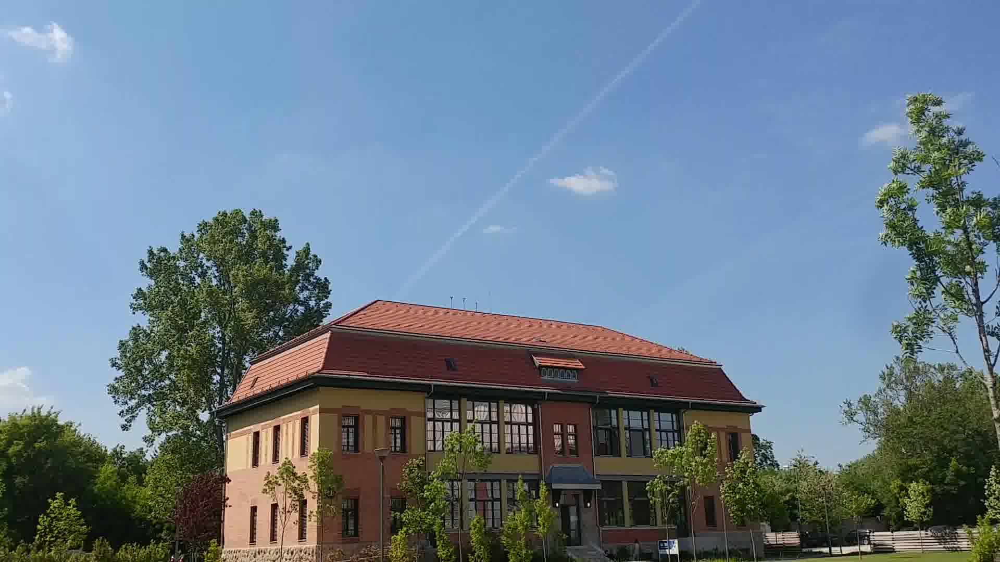
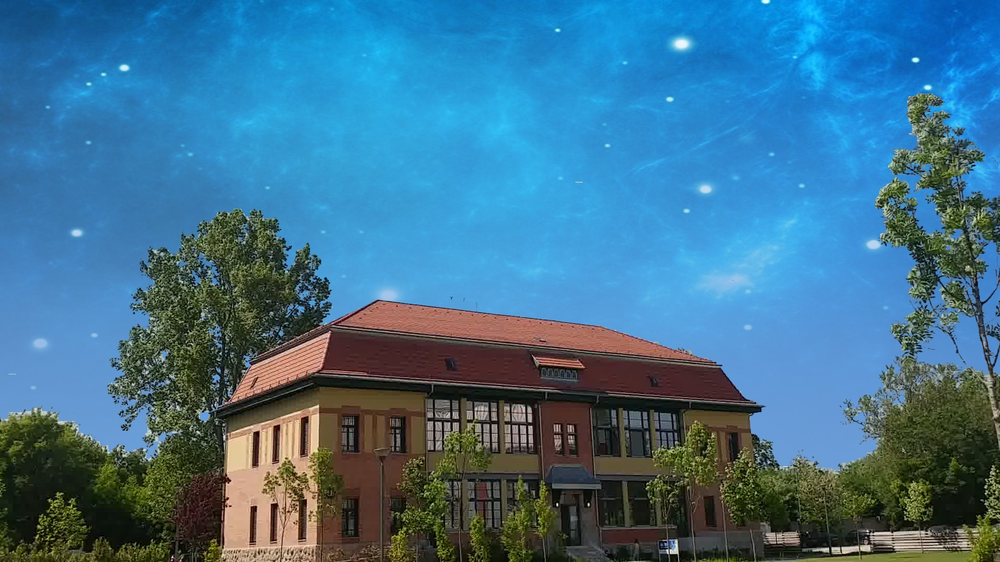

# SkyReplacement

Computer Vision Final Project by Tiffany Fong and Shelby Ziccardi.

This program takes a video (sequence of images) and warps the sky to a new image. By tracking feature points across these images, the new sky will also move in the same direction as the features.

## How to Use

**1. Video -> Frames**

In terminal, go to the ffmpeg folder, and convert the original video into a sequence of image frames. SkyReplacement uses a 7-digit padding format for the filenames (i.e. `image0000001.jpg`). 

```
./ffmpeg -i [filepath to original video] [filepath to image sequence]%07d.jpg; 
```

For example:

```
./ffmpeg -i ORIGINALVIDEO.mp4 INPUT%07d.jpg; 
```

**2. Run SkyReplacement**

For Mac OS X, add this script to the `runme.sh` file. Adding multiple lines will run SkyReplacement sequentially. 

```
src/imgpro [filepath to first original image] [filepath to first output image] \
-skyReplace [filepath to new sky image] [number of frames]
```

The number of frames refers to how many images were produced by the ffmpeg program, but you can use a smaller number for testing purposes.

For example:

```
src/imgpro INPUT0000001.jpg OUTPUT0000001.jpg \
-skyReplace NEWSKY.jpg 50
```

Then, run the script in the main SkyReplacement folder:

```
sh runme.sh
```

For Windows, edit the `runme.bat` file (note that `.bat` files use `\` for filepaths).

After running the script, a sequence of images (with replaced sky) will appear in the output filepath specified.


**3. Frames -> Video**

Go to the ffmpeg folder to convert the image sequence back to video format.

```
./ffmpeg -i [filepath to image sequence]%07d.jpg [filepath to output video] -preset slow 
```

For example:

```
./ffmpeg -i OUTPUT%07d.jpg FINALVIDEO.mp4 -preset slow 
```


## Example Images





## Notes / Known Problems

SkyReplacement works best on videos with:

- **Clear, blue skies** - Gray or night skies are less likely to be detected. Alternatively, other sky-colored objects may be unintentionally warped.
- **Non-moving objects** to better track the video's background (where the sky is).
- **Minimal camera movement**. Features in the first frame must be present in the next frames in order to calculate the motion of the sky.

Currently, SkyReplacement warps the sky via translation, not perspective transformation. Thus, rotation in the video will not look right.
